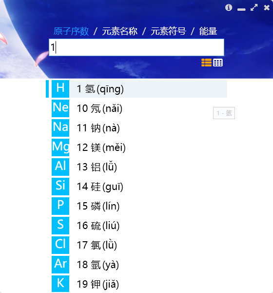
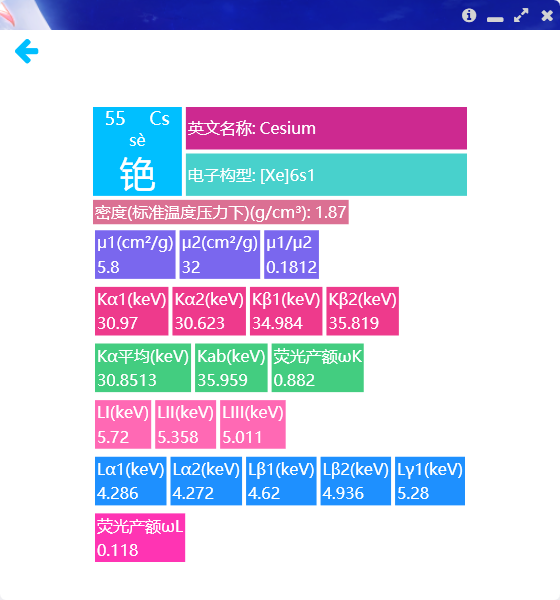
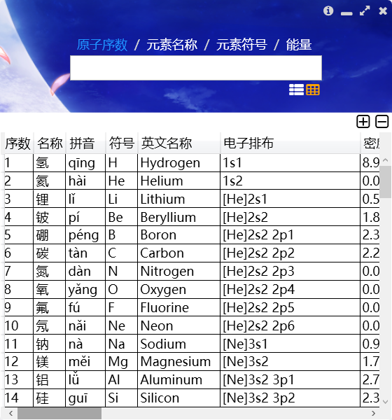

# X射线荧光分析数据查询软件

一个简单的查询数据库的小程序。

---

- WPF框架
- MVVM风格
- SQLite3数据库
- 通过LINQ to SQL方式来筛选数据
---

## 截图

## 更新

- 2021.03.09 更新

  更新了依赖包
  更新至1.0.7版本
  添加软件截图

- 2018.09.19 更新

  更新了依赖包

  最终版本，不再更新

- 2018.01.14 更新

  更新mvvmlight版本到`v5.4.1`，支持CommonServiceLocator  
  更新CommonServiceLocator至`2.03`  
  更新SQLite.Core到`1.0.108.0`  
  移除无用代码

- 2017.12.23 更新
  
  修改程序内的图标为FontAwesome，更新样式

- 2017.12.10 更新

  更新：仅能在窗口上半部分拖动，禁止在窗口最大化后拖动

- 2017.12.10 更新

  更新SQLite.Core到1.0.106.0
  
  添加了ListViewItem的ToolTip

- 2017.10.31 更新

  syntax fixed

- 2017.10.12 更新

  更新CommonServiceLocator至2.01，替换了MvvmLight内的SimpleIoc为IoC
  
  更新了SQLite的驱动

- 2017.09.20 更新

  添加了数据库丢失时启动程序的错误处理

- 2017.08.11 更新

  视觉优化：修改窗口为自定义圆角窗口
  
  添加：关于对话框
  
  修改：一些视图上的小幅修改

- 2017.07.26 更新

  更改：禁止表格视图下对数据进行修改

- 2017.07.23 更新

  添加：按能量筛选时显示匹配到的能量
  
  更改：列表元素的显示

- 2017.07.16 更新

  修改了放大和缩小字体按钮的外观

- 2017.07.14 更新

  修复：从其它页面返回到列表时，列表会初始化的问题
  
  更改：变更搜索模式后，清空搜索框，防止下次搜索出错
